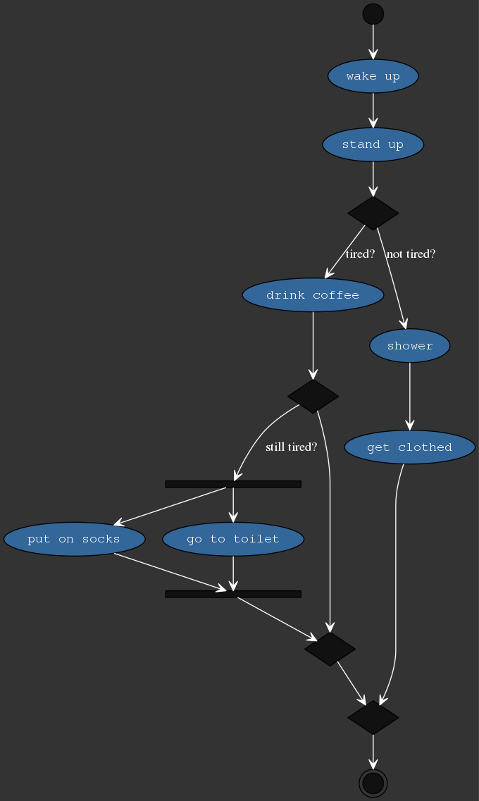

[](https://goreportcard.com/report/github.com/windler/AwesM) [](https://circleci.com/gh/windler/AwesM) [](https://codebeat.co/projects/github-com-windler-awesm-master)
# AwesM - Awesome Modeling
`AwesM` is a tool that simplifies the generation of graphviz diagrams using the `awesome modeling language`. This project is still under development. Currently, there is only an option to generate activity diagrams. There will be no installation instructions until first major release. Stay tuned!

## Examples
`yaml-File`:
```yaml
diagram:
    - start
    - wake up
    - stand up
    - if: 
        "not tired?":
            - shower
            - get clothed
        "tired?":
            - drink coffee
            - ifopt:
                "still tired?":
                    - fork:
                        path1:
                            - put on socks
                        path2:
                            - go to toilet
    - end
``` 

```bash
awesm examples/simple_test.yaml
```

Output:  

