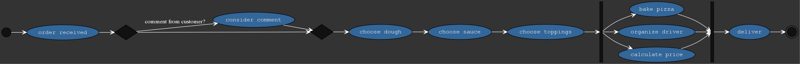

[](https://goreportcard.com/report/github.com/windler/AwesM) [](https://circleci.com/gh/windler/AwesM) [](https://codebeat.co/projects/github-com-windler-awesm-master)
# AwesM - Awesome Modeling
`AwesM` is a tool that simplifies the generation of graphviz diagrams using the `awesome modeling language`. Currently, there is only an option to generate activity diagrams.

# Installation 
```bash
go get github.com/windler/AwesM
```

Make sure you have [graphviz](https://www.graphviz.org/) installed.

# Usage
After creating a yaml file describing your diagram, you just call
```bash
awesm path/file.yaml
```

This will create a graph in top/down presentation. You can change to left/right by calling 

```bash
awesm path/file.yaml LR
```

# Activity diagram
Every activity diagram starts with the keyword `activity`. The start and end of the diagram are represented by the keywords `start` and `end`. The following keywords are possible:

| Keyword       | Description                                        |
|--|--|
| if | Starts a condition. Multiple paths are allowed. |
| ifopt | Starts a condition with only one subpath. A scecond path is directly connect with the join |
| fork | Creates parallelizm. Multiple paths are allowed | 

Please read the following examples to fully understand the yaml structure.

## Activity diagram examples

### pizza order (left/right)
`yaml-File`:
```yaml
activity:
    - start
    - order received
    - ifopt: 
        "comment from customer?":
            - consider comment
    - choose dough
    - choose sauce
    - choose toppings
    - fork:
        path1:
            - bake pizza
        path2:
            - organize driver
        path3:
            - calculate price
    - deliver
    - end
``` 

```bash
awesm examples/pizza.yaml LR
```

Output:  


### waking up (top/down)
`yaml-File`:
```yaml
activity:
    - start
    - wake up
    - stand up
    - if: 
        "not tired?":
            - shower
            - get clothed
        "tired?":
            - drink coffee
            - ifopt:
                "still tired?":
                    - fork:
                        path1:
                            - put on socks
                        path2:
                            - go to toilet
    - end
``` 

```bash
awesm examples/simple_test.yaml
```

Output:  

